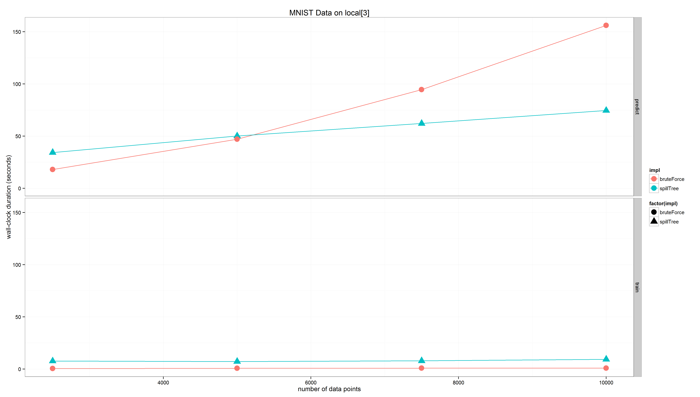

# spark-knn

[](https://gitter.im/saurfang/spark-knn?utm_source=badge&utm_medium=badge&utm_campaign=pr-badge&utm_content=badge)

[](https://travis-ci.org/saurfang/spark-knn)
[](http://codecov.io/github/saurfang/spark-knn?branch=master)

WIP...

k-Nearest Neighbors algorithm (k-NN) implemented on Apache Spark. This uses a hybrid spill tree approach to
achieve high accuracy and search efficiency. The simplicity of k-NN and lack of tuning parameters makes k-NN
a useful baseline model for many machine learning problems.

## How to Use

This package is published using [sbt-spark-package](https://github.com/databricks/sbt-spark-package) and 
linking information can be found at http://spark-packages.org/package/saurfang/spark-knn

k-NN can be used for both classification and regression, which are exposed using the new [Spark ML](http://spark.apache.org/docs/latest/ml-guide.html) 
API based on DataFrame. Both models accept a weight column so predictions can be optionally weighted.

### KNNClassifier

```scala
//read in raw label and features
val training = MLUtils.loadLibSVMFile(sc, "data/mllib/sample_libsvm_data.txt").toDF()

val knn = new KNNClassifier()
  .setTopTreeSize(training.count().toInt / 500)
  .setK(10)

val knnModel = knn.fit(training)

val predicted = knnModel.transform(training)
```

### KNNRegression

```scala
//read in raw label and features
val training = MLUtils.loadLibSVMFile(sc, "data/mllib/sample_libsvm_data.txt").toDF()

val knn = new KNNRegression()
  .setTopTreeSize(training.count().toInt / 500)
  .setK(10)

val knnModel = knn.fit(training)

val predicted = knnModel.transform(training)
```

Furthermore, KNN itself is also exposed for advanced usage which returns arbitrary columns associated with found neighbors.
For example, this can power clustering use case described in the reference Google paper.

When the model is trained, data points are repartitioned and within each partition a search tree is built to support
 efficient querying. When model is used in prediction, the prediction vectors are repartitioned, searched, collected and
 joined back to the search DataFrame. Assuming the training set is much larger, subsequent prediction can be much quicker
 than training. Overall the algorithm displays a `O(m log n)` runtime much better than the naive `O(m n)`
 runtime (for n training points, m prediction points and k = 1). See [benchmark](#benchmark) section for more details.
 
The number of neighbors can be set before and after training. Other parameters must be set before training and they control
the number of partitions and trade off between accuracy and efficiency of individual search tree. 
Please refer to Scala doc for more information.

## Using the Python interface with spark-submit

To run a Spark script in Python with `spark-submit`, use:

```
cd python
python setup.py bdist_egg
cd ..
sbt package

spark-submit --py-files python/dist/pyspark_knn-*.egg --driver-class-path spark-knn-core/target/scala-2.10/spark-knn_*.jar --jars spark-knn-core/target/scala-2.10/spark-knn_*.jar YOUR_SCRIPT
```

## Benchmark

Preliminary benchmark results can be found at [here](data/mnist/benchmark.md).

We have benchmarked our implementation against MNIST dataset. For the canonical 60k training dataset, our implementation
 is able to get a reasonable cross validated F1 score of 0.97 comparing to brute force exact algorithm's *to be computed*.

While the implementation is approximate, it doesn't suffer much even when the dimension is high (as many as the full MNIST
raw dimension: 784). This can be a huge advantage over other approximate implementation such as KD-tree and LSH. *further
benchmark is required*

The implementation also exhibits sub-linear runtime which can lead to huge savings for large datasets.



Note: the duration in the above plot is total runtime thus brute-force exhibits polynomial runtime while SpillTree shows
close to linearithmic runtime.
 
Finally the implementation scales horizontally and has been successfully applied on datasets with low hundreds millions of 
observations and low hundreds dimensions. We have no reason to say why it can't scale to billions of observations as described
in the original Google paper.


## Progress

- [x] implementation of MetricTree, SpillTree, HybridSpillTree
- [x] distributed KNN based on HybridSpillTree
- [x] \(weighted\) Classifier and Regression on ml API
- [ ] benchmark against Brute Force and LSH based kNN in terms of model and runtime performance
- [ ] benchmark against LSH based kNN
- [ ] refactoring of Tree related code

      NB: currently tree are recursively constructed and contain some duplicated code. The data structure is also questionable.
      However preliminary empirical testing shows each tree can comfortably handle tens to hundreds thousands of high dimensional data points.
- [ ] upgrade ml implementation to use DataSet API (pending Spark 1.6)

      NB: the largest cost of this implementation is disk I/O of repartition and distance calculation. While distance calculation
      has no good way to optimize, with DataSet API, we might be able to drastically reduce the shuffle size during training
      and prediction.
- [ ] explore use of random projection for dimension reduction

## Credits

- Liu, Ting, et al. 
"An investigation of practical approximate nearest neighbor algorithms." 
Advances in neural information processing systems. 2004.

- Liu, Ting, Charles Rosenberg, and Henry Rowley. 
"Clustering billions of images with large scale nearest neighbor search." 
Applications of Computer Vision, 2007. WACV'07. IEEE Workshop on. IEEE, 2007.
